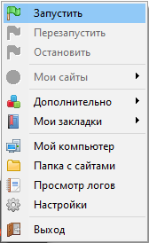
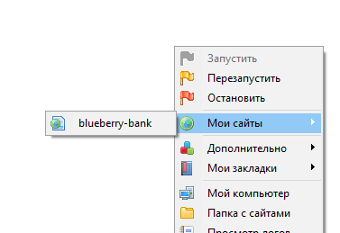

<div align="center">
    
</div>

<div align="center">
    <span style="font-size:28px;">Blueberry Bank</span>
</div>

##

Данный репозиторий представляет собой итоговый учебный проект семестровой работы по дисциплине "Основы проектирования баз данных".

## Используемые технологии

| Стек     | Инструменты          |
| -------- | -------------------- |
| Frontend | HTML+PHP+Tailwind+JS |
| Backend  | PHP+MySQL            |

## Структура

```sh
blueberry-bank/
├─ assets/      # Медиа-контент
├─ components/  # HTML+PHP модули
├─ include/     # Основная логика и работа с MySQL
└─ index.php    # Точка входа
```

## Запуск

В качестве локального сервера достаточно использовать [Open Server Panel v5.5.2+](https://ospanel.io/) с включенными модулями `MySQL-5.6` и `PHP_7.1x64`.

0. Склонируйте репозиторий в папку `domains/`:

```bash
git clone https://github.com/levalyukov/blueberry-bank.git
```

1. Запустите OSPanel:

|  |
| ------------------------------------------- | 

2. Откройте проект:

|  |
| ----------------------------------------------- |